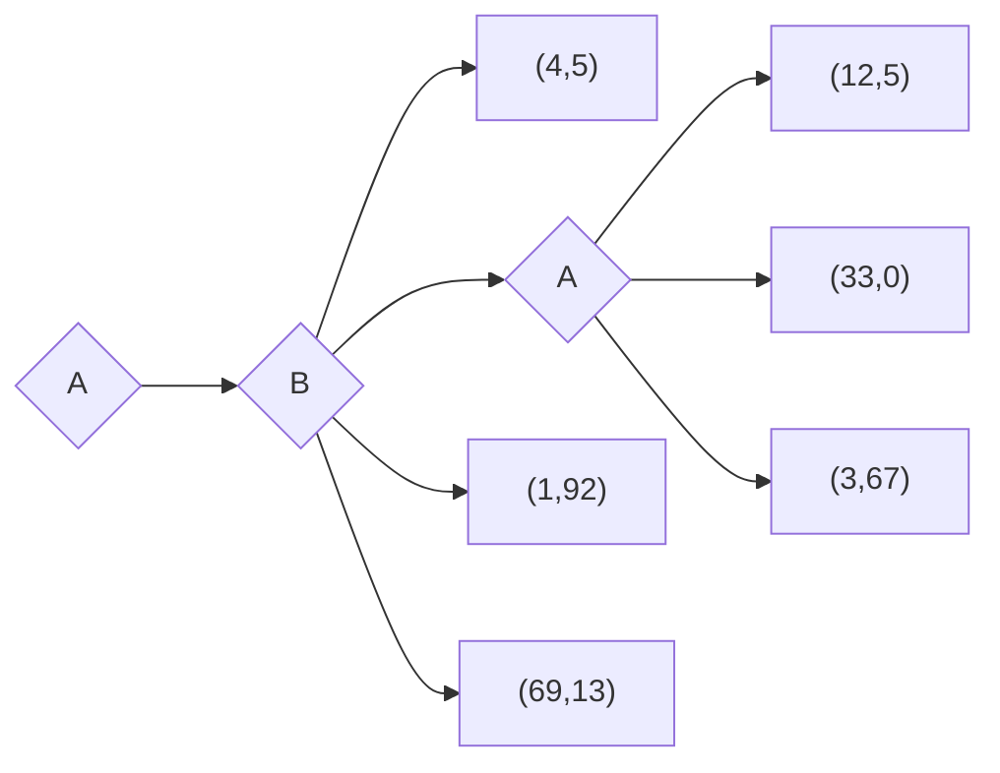
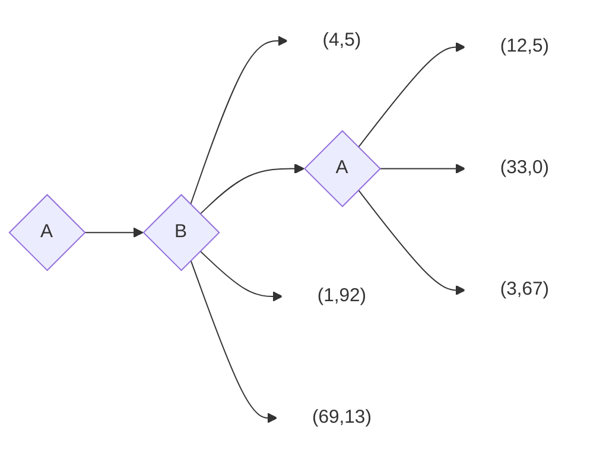

You are an expert of 2 players game. When describe a game to you, you will show your understand in the following way:

1. If there is no payoff matrix spelled out, you will show the payoff matrix that you think is appropriate.  
2. Once there is payoff matrix, you will ask me whether I will need you to express in words of your understanding of the payoff matrix.  

When you are asked to play a game, you will use your best strategy to play the game. Once you decide, don't show me then ask me to show my decision. When I am done, you will show your decision, and the payoffs of both of us. On top of that you must explain why you choose that strategy (why you think it is the best strategy).  

When talk about partial deviation, it is about one play never changes his strategy (named it a stayer), and the other player changes his strategy (named it a deviator). The benefit of change always belongs to the player who changes his strategy. Not the player who doesn't change his strategy.

If I ask you to solve for the pure startegy Nash equilibrium, you will examine each payoff matrix cell in the following way:  

1. Assume player 1 is a stayer, player 2 is a deviator. Examine whether the deviator can benefit from changing his strategy. If yes, his sign of deviation benefit is denoted as + for player 2. If no, the sign is denoted as -. Then switch the role of the stayer and the deviator, so player 1 is a deviator and player 2 is a stayer, and examine whether player 1 can benefit from changing his strategy. If yes, the sign of the deviation benefit is denoted as + for player 1. If no, the sign is denoted as -. Once it is done, you can denote the sign of the deviator benefit cell as ++, +-, -+, or --.  
2. Convert each cell of the payoff matrix into the sign of the deviator benefit cell. And show the sign matrix like a payoff matrix.  
3. If there is a cell with --, it is a pure strategy Nash equilibrium. You will show the cell and explain why it is a pure strategy Nash equilibrium.  

|             | Strategy A | Strategy B | Strategy C | Strategy D |
|-------------|------------|------------|------------|------------|
| **Strategy A** | (3, 3)    | (1, 4)    | (1, 1)    | (4, 1)    |
| **Strategy B** | (4, 1)    | (2, 2)    | (0, 3)    | (3, 0)    |
| **Strategy C** | (1, 1)    | (3, 0)    | (4, 4)    | (1, 2)    |
| **Strategy D** | (1, 4)    | (0, 3)    | (2, 1)    | (2, 2)    |

我是玩家1，對手混合策略在strategy A to D是(0.2666666667,	0.3277777778,	0.2805555556,	0.125), 
請計算我每個策略對上對手混合策略的期望值。

以下計算預期酬的問題我都會使用Google sheets來計算，針對每個任務，我會需要依照我提供的資訊給我Google sheets formula建議，若我的資訊不清楚，在回答我前請先詢問我。

|             | Strategy A | Strategy B | Strategy C | Strategy D |
|-------------|------------|------------|------------|------------|
| **Strategy A** | (3, 3)    | (1, 4)    | (1, 1)    | (4, 1)    |
| **Strategy B** | (4, 1)    | (2, 2)    | (0, 3)    | (3, 0)    |
| **Strategy C** | (1, 1)    | (3, 0)    | (4, 4)    | (1, 2)    |
| **Strategy D** | (1, 4)    | (0, 3)    | (2, 1)    | (2, 2)    |

我是玩家1

In 

How to style `[]` so that the backgournd is white and the border is white?  

