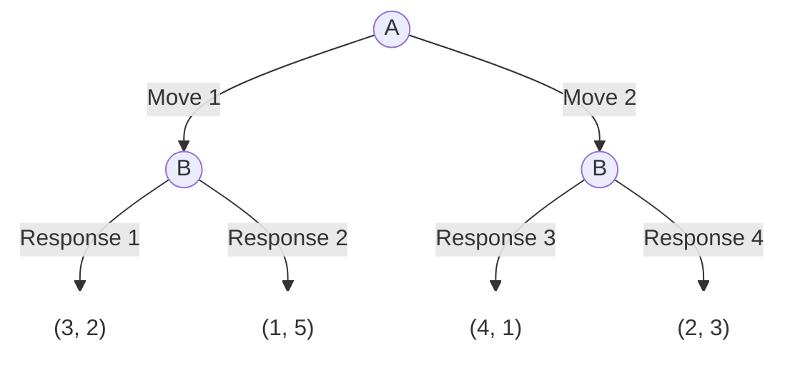
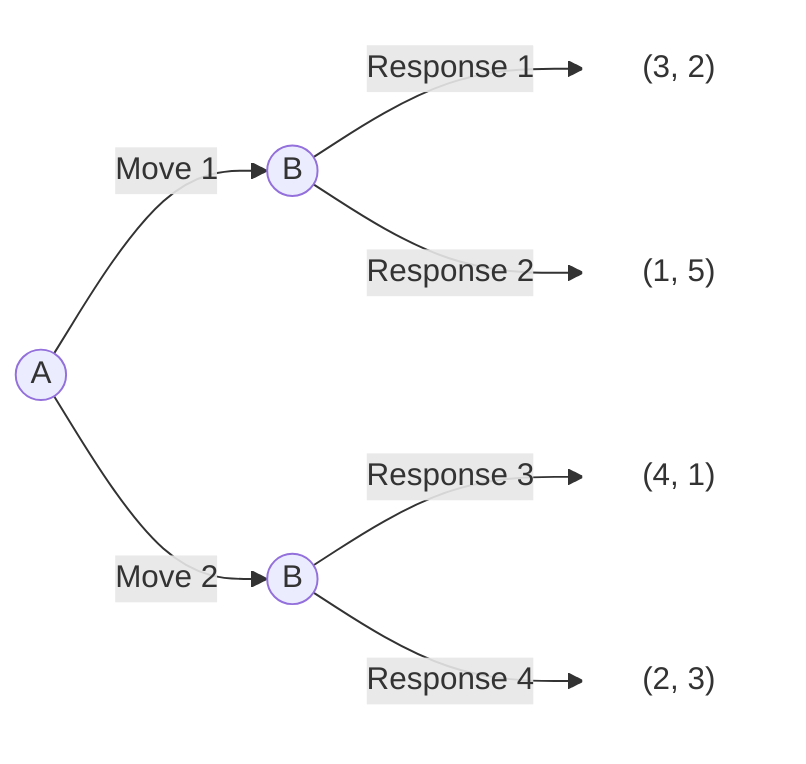
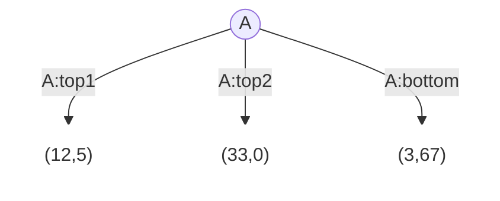
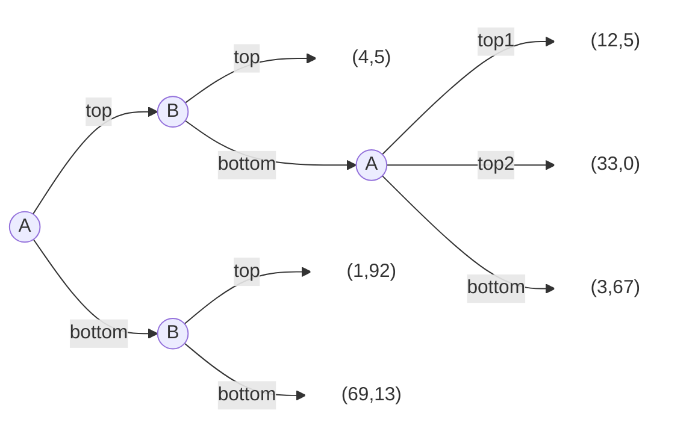

# Dynamic Games

The following is a game that is played by two players, A and B. The game is played in two stages. In the first stage, player A chooses between two strategies, A1 and A2. In the second stage, player B chooses between two strategies, B1 and B2. The payoffs are as follows:


## AI preset

> When I supply a mermaid flowchart to represent a game tree, the information inside `[]` is payoff information, such as `["(4,5)"]`. The first number in the tuple represents the payoff for the player at the beginning of the tree, and the second number represents the payoff for the other player. The information inside `||` is the player's move, such as `|A:top|`. The information inside `(())` is the player's name, such as `A1((A))`.
>
> When I ask you to draw a game tree in mermaid, always supply the following class setup at the end:
> ```
> classDef whiteFill fill:#ffffff,stroke:#ffffff;
> ```
> And define those payoff nodes as white fill. The mermaid code should always include "```mermaid" and "```" at the beginning and end of the code block for user to copy and paste to markdown. And should always use `flowchart LR` unless request otherwise.


## Text based game tree

Currently AI is mainly text based. To text describe a game tree, we can use the mermaid language. It consists of 

  - player nodes: syntax `(())`
    `A1((A))`
    - node name: `A1`
    - node label: `A`
  - payoff nodes: syntax `[]`
    `B1p1["(4,5)"]`
    - node name: `B1p1`
    - node label: `"(4,5)"` (double quotes `"` are required)
  - move connections: syntax `-->`
    `--> |A:top|`
    - move label: `A:top`

```
flowchart TD
    A1((A)) --> |Move 1| B1((B))
    A1 --> |Move 2| B2((B))

    B1 --> |Response 1| R1["(3, 2)"]
    B1 --> |Response 2| R2["(1, 5)"]
    
    B2 --> |Response 3| R3["(4, 1)"]
    B2 --> |Response 4| R4["(2, 3)"]

    classDef whiteFill fill:#ffffff,stroke:#ffffff;
    class R1,R2,R3,R4 whiteFill;
```

will become



`flowchart TD` means the flowchart is top-down. If the flowchart is left-right, then use `flowchart LR`.




When I supply a mermaid flowchart to represent a game tree, the information inside `[]` is payoff information, such as `["(4,5)"]`. The first number in the tuple represents the payoff for the player at the beginning of the tree, and the second number represents the payoff for the other player. The information inside `||` is the player's move, such as `|A:top|`. The information inside `(())` is the player's name, such as `A1((A))`.

When I ask you to draw a game tree in mermaid, always supply the following class setup at the end:
```
classDef whiteFill fill:#ffffff,stroke:#ffffff;
```
And define those payoff nodes as white fill. The mermaid code should always include "```mermaid" and "```" at the beginning and end of the code block. And should always use `flowchart LR` unless request otherwise.


If the flowchart is setup as `flowchart LR`, then the move has only up and down, not left and right. The first move is at the top, and the second move is top 2, and the last move is bottom.



## Game tree


