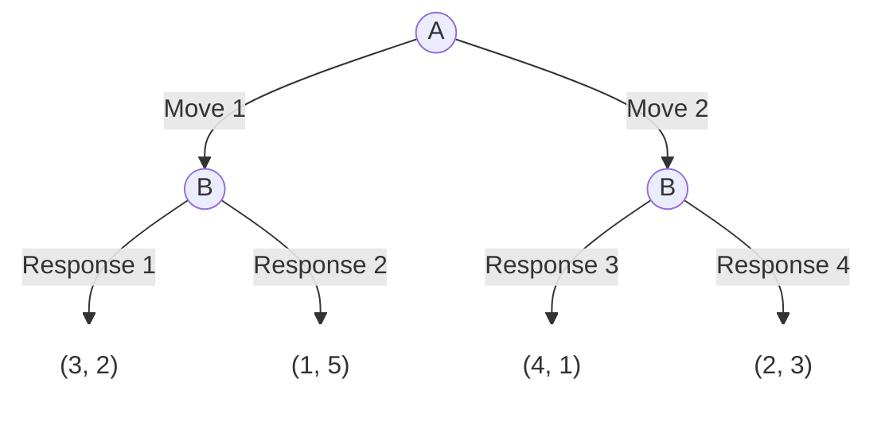
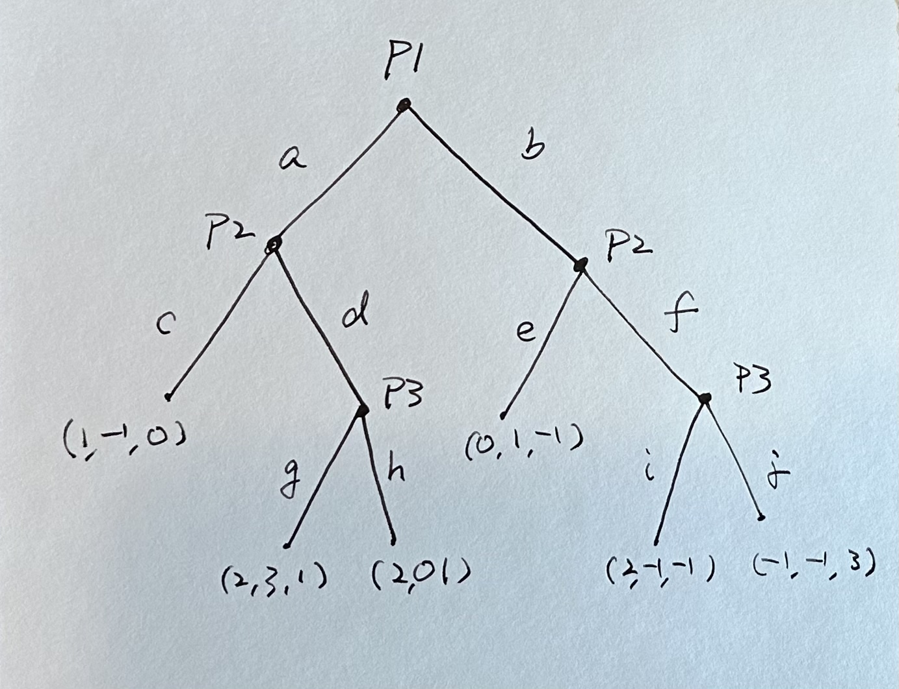
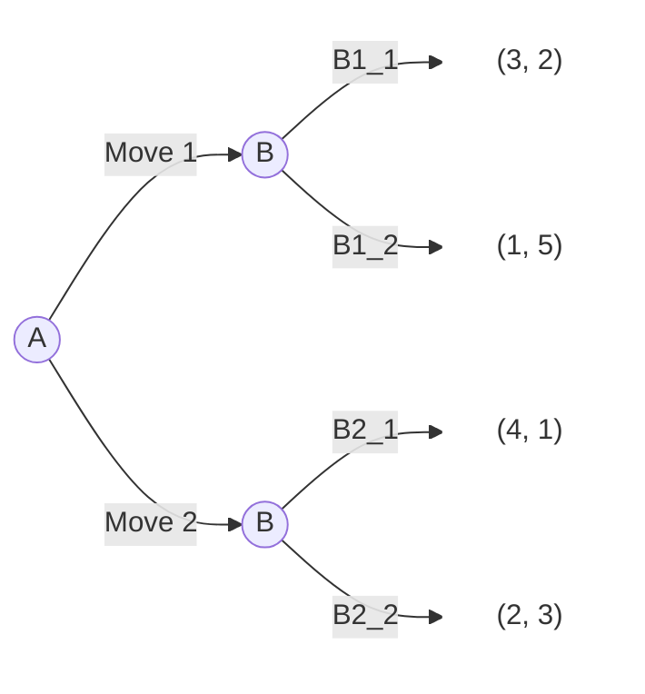

# Dynamic Games

  - 如何訓練AI描述動態賽局的樹狀結構？ 用什麼文字符號來描述？  
  - 說不清楚用圖片AI可以懂嗎？  
  
## Mermaid syntax

Mermaid syntax[^1]是一種用來描述流程圖、序列圖、甘特圖等的語法。它是一種基於JavaScript的繪圖工具，在Markdown文件中使用Mermaid syntax描述圖形，在如下的code chunk中，Mermaid syntax的描述會被轉換成圖形。

\`\`\`mermaid
mermaid syntax
\`\`\`

  - \`\`\` 代表code chunk的開始和結束  
  - 前面的mermaid代表code chunk使用Mermaid syntax

### 練習1

在[hackmd.io](https://hackmd.io)創立一個mermaid code chunk, 並把前面的樹狀圖copy (會得到該圖的mermaid syntax) 然後paste過去。

## AI preset

要AI揉合兩個知識：  

  - Game tree
  - Mermaid syntax

### 教AI如何文字描述game tree

若你打算要AI揉合兩種知識，以範例來設定你的prompt是個不錯的作法。

  - 一個Game tree實例，加上mermaid語法的說明。

***

<https://github.com/tpemartin/113-1-AI-Game/blob/cfda5761b656c1c3be1906758f5dfa6ec7fc3c64/chat/preset-dynamic-game.txt#L2-L25>

### Game tree圖片

  - AI懂嗎？

#### 練習2

按滑鼠右鍵存以下的game tree圖檔，然後上傳到ChatGPT，並請它"描述這張圖片的game tree"。

#### 練習3

自己畫一張game tree試試看。

## Game play

  1. 你同時扮演A和B, 你的目的是最大化你的總酬報，全班總分最高者得2分bonus，其餘得1分bonus。（dynamic-A1，dynamic-B1，dynamic-B2）。
  2. 你同時扮演A和B, 這次不是以總報酬來看，而是分開看。最後A部份得分最高者會得2分bonus，其餘得1分bonus。B部分也一樣得分最高者得2分bonus，其餘1分。所以bonus total最高4， 最低會是2. （dynamic-A1，dynamic-B1，dynamic-B2）

## Conclusion

Dynamic game:

  - Play forwardly
  - Think backwardly (and strategically)

[^1]: Mermaid is a JavaScript-based diagramming and charting tool that renders Markdown-inspired text definitions to create and modify diagrams dynamically. (<https://mermaid.js.org/intro/>)