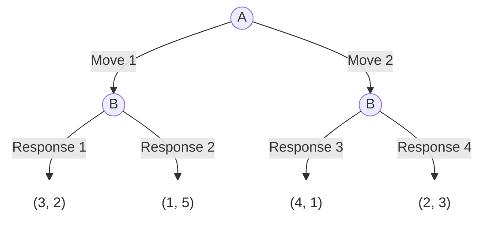
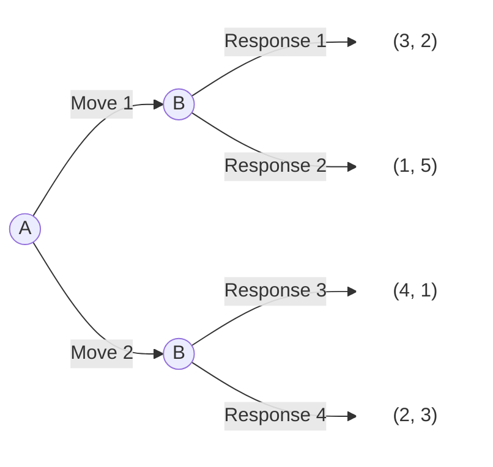

# Dynamic Games




  - 如何訓練AI描述動態賽局的樹狀結構？ 用什麼文字符號來描述？  
  - 說不清楚用圖片AI可以懂嗎？  

## AI preset

要AI揉合兩個知識：  

  - Game tree
  - Mermaid syntax[^1]

### 教AI如何文字描述game tree

若你打算要AI揉合兩種知識，以範例來設定你的prompt是個不錯的作法。

  - 一個Game tree實例，加上mermaid語法的說明。

***

<https://github.com/tpemartin/113-1-AI-Game/blob/5678848b5162b38361a6b659849402e359806692/chat/preset-dynamic-game.txt#L2-L23>


### Game tree圖片

  - AI懂嗎？
  


When I supply a mermaid flowchart to represent a game tree, the information inside [] is payoff information, such as ["(4,5)"]. The first number in the tuple represents the payoff for the player at the beginning of the tree, and the second number represents the payoff for the other player. The information inside || is the player's move, such as |A:top|. The information inside (()) is the player's name, such as A1((A)).

> When I supply a mermaid flowchart to represent a game tree, the information inside `[]` is payoff information, such as `["(4,5)"]`. The first number in the tuple represents the payoff for the player at the beginning of the tree, and the second number represents the payoff for the other player, so on so forth if there are more than two players. The information inside `||` is the player's move, such as `|A:top|`. The information inside `(())` is the player's name, such as `A1((A))`.
>
> When I ask you to draw a game tree in mermaid, follow the previous paragraph's definition of player nodes, payoff nodes, and moves requirement. For payoff nodes, create reasonable node names. And always supply the following class setup at the end:
> ```
> classDef whiteFill fill:#ffffff,stroke:#ffffff;
> ```
> And define those payoff nodes as white fill -- the definition syntax should trim off unneccessary white space between commas. The mermaid code should always use `flowchart LR` unless requested otherwise.
> 
> Whenever I request Mermaid syntax, make sure your code should always include the mermaid syntax holder used in markdown. 
>

## Hackmd.io

It is a markdown editor that supports mermaid syntax. You can use it to draw game trees.

  - <https://hackmd.io>

## Hand-drawn game tree

  - 標明player names (盡量靠近player nodes)  
  - 標明player moves (盡量靠近move connections)  
  - 以tuple, 即(.., ..)，標明payoffs

畫好後拍照上傳Ai, 並請它draw the game tree. (記得先送preset)

## Game tree in mermaid

Currently AI is mainly text based. To text describe a game tree, we can use the mermaid language. It consists of 

  - player nodes: syntax `(())`
    `A1((A))`
    - node name: `A1`
    - node label: `A`
  - payoff nodes: syntax `[]`
    `B1p1["(4,5)"]`
    - node name: `B1p1`
    - node label: `"(4,5)"` (double quotes `"` are required)
  - move connections: syntax `-->`
    `--> |A:top|`
    - move label: `A:top`

```
flowchart TD
    A1((A)) --> |Move 1| B1((B))
    A1 --> |Move 2| B2((B))

    B1 --> |Response 1| R1["(3, 2)"]
    B1 --> |Response 2| R2["(1, 5)"]
    
    B2 --> |Response 3| R3["(4, 1)"]
    B2 --> |Response 4| R4["(2, 3)"]

    classDef whiteFill fill:#ffffff,stroke:#ffffff;
    class R1,R2,R3,R4 whiteFill;
```

will become


`flowchart TD` means the flowchart is top-down. If the flowchart is left-right, then use `flowchart LR`.



## Game play


  1. You are player A. dynamic-A1 (choose between Move 1 and Move 2)
  2. Look at the result from dynamic-A1. Suppose you are player B. How would you play the game? dynamic-B1-tricky (choose between Response 1 and Response 2, and Response 3 and Response 4)  
  3. Look at the result from dynamic-A1. Suppose you are player B. How would you play the two sub games: dynamic-B1 (choose between Response 1 and Response 2) and dynamic-B2 (choose between Response 3 and Response 4)

老師會計算你在兩個角色的總酬報加總，全班最高的加2， 其他加1分 bonus

## Conclusion

Dynamic game:

  - Play forwardly
  - Think backwardly (and strategically)


[^1]: Mermaid is a JavaScript-based diagramming and charting tool that renders Markdown-inspired text definitions to create and modify diagrams dynamically. (<https://mermaid.js.org/intro/>)