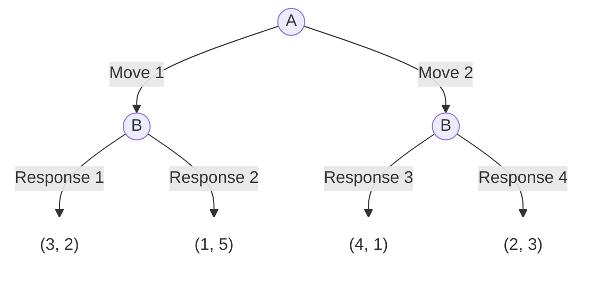
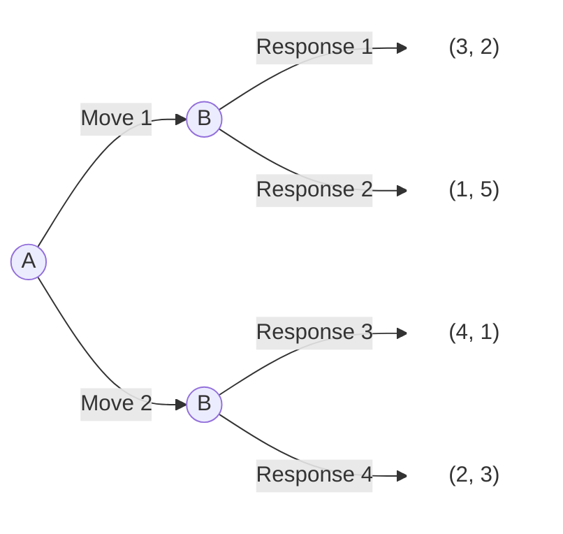

# Dynamic Games


  - 如何訓練AI描述動態賽局的樹狀結構？

## AI preset

以下的prompt設定，讓AI看懂mermaid[^1]語法所繪的賽局樹狀結構。同時也要求AI若要回答動態賽局問題，也要使用mermaid語法來描述。

> When I supply a mermaid flowchart to represent a game tree, the information inside `[]` is payoff information, such as `["(4,5)"]`. The first number in the tuple represents the payoff for the player at the beginning of the tree, and the second number represents the payoff for the other player. The information inside `||` is the player's move, such as `|A:top|`. The information inside `(())` is the player's name, such as `A1((A))`.
>
> When I ask you to draw a game tree in mermaid, always supply the following class setup at the end:
> ```
> classDef whiteFill fill:#ffffff,stroke:#ffffff;
> ```
> And define those payoff nodes as white fill. The mermaid code should always use `flowchart LR` unless requested otherwise.
> 
> Whenever I request Mermaid syntax, make sure your code should always include the mermaid syntax holder used in markdown. 

## Hand-drawn game tree

  - 標明player names (盡量靠近player nodes)  
  - 標明player moves (盡量靠近move connections)  
  - 以tuple, 即(.., ..)，標明payoffs

畫好後拍照上傳Ai, 並請它draw the game tree. (記得先送preset)

## Game tree in mermaid

Currently AI is mainly text based. To text describe a game tree, we can use the mermaid language. It consists of 

  - player nodes: syntax `(())`
    `A1((A))`
    - node name: `A1`
    - node label: `A`
  - payoff nodes: syntax `[]`
    `B1p1["(4,5)"]`
    - node name: `B1p1`
    - node label: `"(4,5)"` (double quotes `"` are required)
  - move connections: syntax `-->`
    `--> |A:top|`
    - move label: `A:top`

```
flowchart TD
    A1((A)) --> |Move 1| B1((B))
    A1 --> |Move 2| B2((B))

    B1 --> |Response 1| R1["(3, 2)"]
    B1 --> |Response 2| R2["(1, 5)"]
    
    B2 --> |Response 3| R3["(4, 1)"]
    B2 --> |Response 4| R4["(2, 3)"]

    classDef whiteFill fill:#ffffff,stroke:#ffffff;
    class R1,R2,R3,R4 whiteFill;
```

will become



`flowchart TD` means the flowchart is top-down. If the flowchart is left-right, then use `flowchart LR`.




[^1]: Mermaid is a JavaScript-based diagramming and charting tool that renders Markdown-inspired text definitions to create and modify diagrams dynamically. (<https://mermaid.js.org/intro/>)