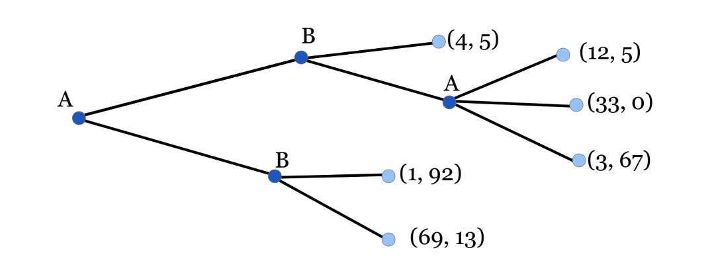
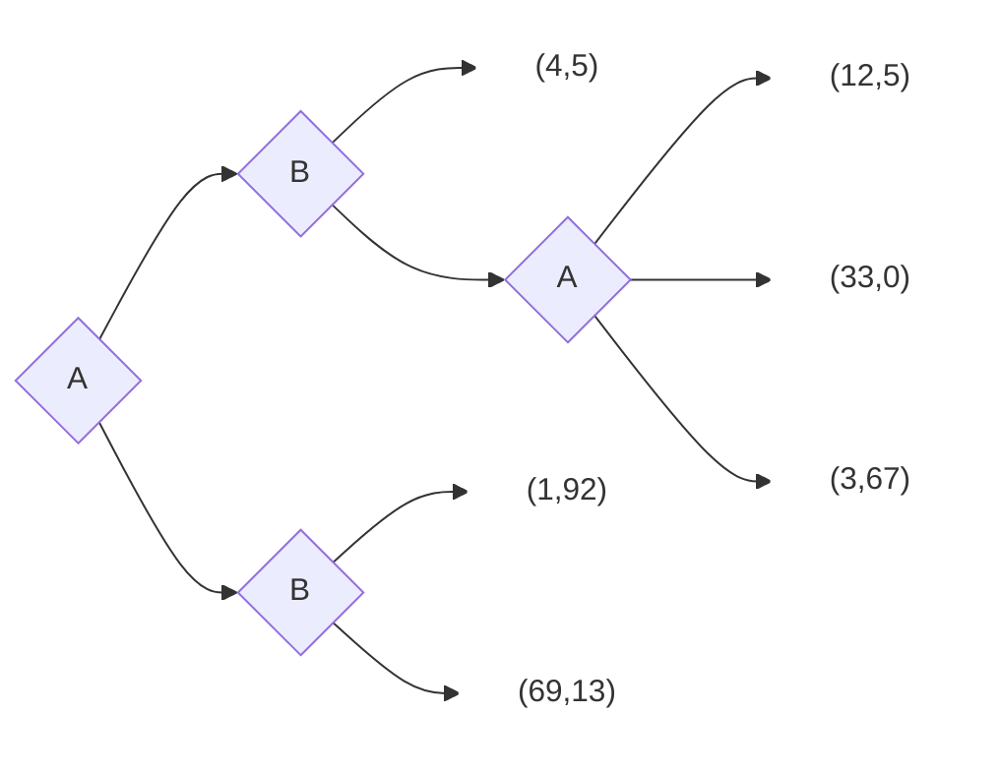

# Dynamic Games

The following is a game that is played by two players, A and B. The game is played in two stages. In the first stage, player A chooses between two strategies, A1 and A2. In the second stage, player B chooses between two strategies, B1 and B2. The payoffs are as follows:

