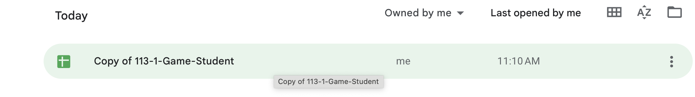

# Recap

  - 個人Game Sheet
  - Public information game sheet

## 個人Game sheet

1. 點開自己的Game Sheet(上週已設定好)

2. 下載新遊戲單。

  

| 取得新遊戲 | 出招 |
|---|---|
|  |  |
| | 確認在正對的遊戲sheet頁面 |

3. 在遊戲單上出招。（在要出的招式上寫上數字 1）

4. 出招

 

 
